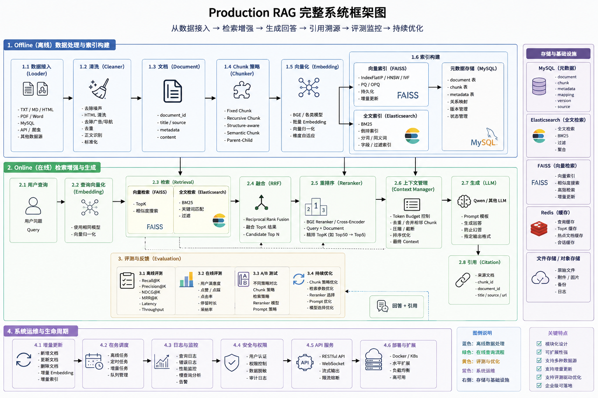

# Production RAG

生产级 RAG（Retrieval-Augmented Generation）问答服务：文档摄入 → 检索 → 重排 → 上下文管理 → 生成 → 引用溯源。

## 特性

- **多格式文档摄入**：支持 TXT / HTML / PDF / Word(.docx)，含清洗、分块（固定/递归）、embedding 向量化
- **混合检索**：向量检索（FAISS）+ BM25 关键词检索 + RRF 融合，支持 Cross-Encoder 重排
- **先过滤后检索（Permission-aware）**：向量（FAISS IDSelector / Milvus filter）/ BM25 / ES terms 均在可读文档集合内预过滤，不可读内容不参与打分、不占用 top-k 名额
- **多路召回（Multi-Query）**：LLM 把查询扩展成多个角度子查询，各自检索后按 chunk 合并去重，弥补单查询召回不足
- **上下文管理**：chunk 去重（span 重叠 + Jaccard）、邻接合并、**分数加权预算**（高分块保留更多内容）、超预算块跳过装填
- **多轮对话**：`history` 透传 + Query 改写（LLM 指代消解，如"那价格呢"→"铁矿近期价格走势"），改写结果用于检索与生成
- **引用溯源**：答案中的 `[1][2]` 引用自动映射到源 chunk，含文件名和字符偏移；解析兼容 `[1,2]`、`【1】` 等多种格式
- **多 LLM 后端**：`stub`（零依赖）/ `qwen`（DashScope）/ `openai`（任意 OpenAI 兼容端点：OpenAI / DeepSeek / Kimi / 智谱 GLM / 百炼 compatible-mode / vLLM / Ollama…），仅需 base_url + api_key + model
- **流式生成**：基于 LLM 后端的真流式 SSE 输出，首字延迟≈模型开始输出时间
- **生成可靠性**：超时控制 + 指数退避重试（网络异常/429/5xx 自动重试，4xx 不重试）+ **并发限流**（防止慢请求占满线程池）
- **多后端持久化**：MySQL 存储文档/chunks（含连接池与 CASCADE 删除）+ Elasticsearch 全文检索 + Milvus 向量库（替代本地 FAISS），均可按开关启用
- **缓存优化**：embedding/reranker 模型按名复用 + 索引版本号感知，上传/删除后自动刷新索引、不重载模型
- **安全加固**：上传路径穿越防护 + 50MB 大小限制，分块读取防内存打爆
- **认证与 RBAC**：JWT 登录（bcrypt 密码哈希 + PyJWT）、用户/角色/权限点三级模型、`require_permission` 路由门禁、种子账号脚本，业务 API 全部要求 Bearer token
- **多租户隔离**：`tenant_id` 贯穿 MySQL/ES/Milvus/索引路径/缓存 key，租户间数据完全隔离
- **文档级 ACL**：`documents.owner_user_id` + `document_acl` 授权表，按 用户/角色 授予 read/write/delete；检索/列表按可读文档过滤，删除按归属校验；删文档/用户/角色时级联清理授权（document_acl 外键 + 代码级）
- **权限感知缓存**：RAG 结果缓存 key 含 租户+权限指纹+user_id+索引版本，不同租户/权限/用户不串缓存，权限变更或索引重建自动失效；支持**内存（LRU）/ Redis** 双后端，Redis 不可用时自动降级内存
- **审计日志**：401/403 越权自动记录 + 登录/用户/角色/文档操作显式记录（MySQL `audit_logs` 表），支持按租户/操作者/action 过滤查询
- **稳定 ID 索引**：向量使用显式稳定 ID（chunk_id 哈希），删除按 ID 移除向量、无需全量重建；upload 追加写入不覆盖旧索引
- **可观测性**：Prometheus 指标采集 + 请求追踪（trace_id）+ 深度健康检查（线程池化，组件挂起不阻塞其他请求）
- **后台任务**：大文档上传/索引重建支持后台异步执行 + 任务状态查询
- **管理台 Web UI**：登录鉴权 + 9 面板（问答/上传/文档/索引/任务/用户/角色/审计日志/监控），支持文档 ACL 授权、用户/角色管理、审计查询、指标可视化（`/admin` 或 `/` 跳转）
- **监控指标**：查询总耗时 P50/P95/P99 + 分阶段耗时（Embedding/向量/BM25/RRF/Rerank/LLM TTFT/总耗时）+ 缓存命中率；后台「监控」面板实时快照（`metrics:read` 权限），或 Prometheus + Grafana 监控栈（历史趋势）
- **Docker 部署**：CPU/GPU 双版本镜像 + docker-compose 一键编排（RAG + MySQL，可选 ES/Milvus）
- **评估体系**：检索指标（Recall/Precision/MRR/NDCG）+ 生成质量评估（Faithfulness/Relevance，LLM-as-Judge）
- **评估回归闭环**：基线存档（`--save-baseline`）/ 对比门禁（`--compare`，指标跌破阈值退出码 1）/ 趋势沉淀（trend.csv）
- **C-MTEB 中文检索基准**：接入 T2Retrieval 评测 + corpus embedding 缓存（corpus 未变直接复用，GitHub Runner 免重复编码）
- **CI 门禁**：GitHub Actions 自动跑测试 + 检索门禁（与入库基线对比，回退即拦截），支持手动全量评测

## 项目架构图



## 项目结构

```
production-rag/
├── app/
│   ├── api/                  # FastAPI 路由层
│   │   ├── chat.py           #   聊天/问答 API（含 SSE 流式）
│   │   ├── health.py         #   深度健康检查
│   │   ├── knowledge.py      #   知识库管理（上传/删除/重建/任务/文档 ACL）
│   │   ├── admin.py          #   用户/角色管理 + 审计查询
│   │   └── __main__.py       #   启动入口（python -m app.api）
│   ├── auth/                 # 认证与 RBAC（JWT/密码哈希/权限点/登录 API）
│   ├── acl/                  # 文档级 ACL（document_acl 表 + 授权判定）
│   ├── audit/                # 审计日志（MySQL 落库 + 401/403 中间件）
│   ├── cache/                # 权限感知查询缓存（内存 LRU / Redis 双后端，key 含租户/权限/user_id）
│   ├── ingestion/            # 文档摄入
│   │   ├── loader/           #   文档加载器（txt/html/pdf/word）
│   │   ├── chunker/          #   分块器（fixed/recursive）
│   │   ├── cleaner/          #   文档清洗
│   │   └── writer.py         #   统一索引写入器（稳定 ID 追加语义）
│   ├── embedding/            # Embedding 模型封装
│   ├── search/               # 检索引擎（vector/bm25/es_fulltext/hybrid + RRF）
│   ├── rerank/               # Cross-Encoder 重排器
│   ├── context/              # 上下文管理（builder/compressor/manager）
│   ├── generation/           # LLM 生成（Stub/Qwen/OpenAI 兼容 + 流式 + 重试 + Query 改写 + Multi-Query）
│   ├── citation/             # 引用提取（兼容多种括号/分隔符格式）
│   ├── rag/                  # RAG 编排（pipeline/service）
│   ├── storage/              # 持久化（MySQL + ES + Milvus + chunk/document 仓储）
│   ├── evaluation/           # 评估（检索指标 / 生成质量 / 回归闭环基线门禁趋势）
│   ├── vector/               # 向量存储（FAISS IndexIDMap2 / Milvus 双后端，显式稳定 ID）
│   ├── static/               # 管理台 Web UI（登录鉴权 + 9 面板）
│   └── core/                 # 基础设施（config/env/logger/metrics/tracing/task_queue）
├── configs/
│   └── config.yaml           # 主配置文件（含 auth/cache/audit 段）
├── .github/workflows/        # CI 门禁（test + eval 检索门禁 + full-eval 全量评测）
├── docker/                   # Docker 部署（CPU/GPU 双 Dockerfile + 主编排 + Prometheus/Grafana 监控栈）
├── scripts/                  # 命令行脚本
│   ├── seed_users.py         #   初始化 RBAC/审计/ACL 表 + 创建种子管理员
│   ├── verify_all.py         #   一键验证脚本（覆盖 5 阶段 19 项检查）
│   ├── ingest.py             #   文档摄入脚本
│   ├── rebuild_index.py      #   全量重建索引（FAISS + MySQL + ES）
│   ├── evaluate.py           #   批量评估（检索 + 生成质量 + 回归闭环）
│   ├── build_eval_dataset.py #   基于 data/raw 自动构建评估数据集
│   ├── download_cmteb.py     #   下载 C-MTEB T2Retrieval 数据（hf-mirror 国内镜像）
│   ├── eval_cmteb.py         #   C-MTEB 检索评测（含 embedding 缓存）
│   ├── cmteb_rerank_diag.py  #   rerank 消融诊断（候选池截断对比）
│   ├── evaluate_retrieval.py #   检索评测脚本（供 CI 门禁）
│   ├── query.py              #   命令行查询
│   ├── context_demo.py       #   上下文管理演示
│   └── rag_mock_demo.py      #   无外部依赖的 RAG 流程演示（stub 生成器）
├── tests/                    # 单元测试（api/cache/citation/context/evaluation/generation/ingestion/rag/search/storage）
├── data/                     # 运行时数据（索引/原始文件/评测数据集）
├── reports/                  # 评估报告输出（baseline/trend/CSV 明细）
├── main.py                   # CLI 交互式入口
├── setup.py                  # 包安装配置
├── requirements.txt          # 依赖清单（含 PyJWT/bcrypt/redis/prometheus-client 等）
├── requirements.lock         # 依赖锁定（精确版本）
├── .env                      # 环境变量（需自建，参考 .env.example）
└── .env.example              # 环境变量示例（含 REDIS_*/MYSQL_*/ES_*/MILVUS_*）
```

## 环境要求

- Python 3.12+
- MySQL 8.0+（可选，`storage.backends.mysql.enabled=false` 时不需要）
- Elasticsearch 8.x（可选，`storage.backends.es.enabled=false` 时不需要）
- Milvus 2.x（可选，`storage.backends.milvus.enabled=false` 时回退本地 FAISS 索引）
- 阿里云 DashScope API Key（`generation.backend=qwen` 时需要）
- 其他 LLM API Key（`generation.backend=openai` 时需要，如 OPENAI_API_KEY / DEEPSEEK_API_KEY）
- Redis（可选，`cache.backend=redis` 时需要）
- Docker + Docker Compose（可选，使用容器部署时需要；GPU 版另需 NVIDIA GPU + nvidia-container-toolkit）
- 网络（C-MTEB 评测需下载数据集与模型，默认走 hf-mirror 国内镜像）

## 快速开始

### 1. 安装依赖

```bash
# 创建虚拟环境
python -m venv .venv

# Windows
.venv\Scripts\activate

# Linux/macOS
source .venv/bin/activate

# 安装依赖
pip install -r requirements.txt
```

### 2. 配置环境变量

在项目根目录创建 `.env` 文件：

```ini
# 认证 / RBAC（生产必须设置 JWT 密钥，未设置回退 config.yaml 的 auth.jwt_secret）
JWT_SECRET=your-long-random-secret

# DashScope（LLM 生成，backend=qwen 时使用，不使用 Qwen 可不配）
DASHSCOPE_API_KEY=sk-your-api-key-here
DASHSCOPE_MODEL=qwen-plus

# OpenAI 兼容端点（LLM 生成，backend=openai 时使用；如 DEEPSEEK_API_KEY 等）
OPENAI_API_KEY=sk-your-api-key-here

# Redis（查询缓存，cache.backend=redis 时；无密码可不配）
REDIS_PASSWORD=

# MySQL（不使用 MySQL 可在 config.yaml 中设 storage.backends.mysql.enabled=false）
MYSQL_HOST=127.0.0.1
MYSQL_PORT=3306
MYSQL_USER=root
MYSQL_PASSWORD=your-password
MYSQL_DATABASE=production_rag
```

> **认证总开关**：`configs/config.yaml` 的 `auth.enabled=true`（默认）时，所有业务 API（chat/knowledge/admin）都需要携带 `Authorization: Bearer <token>` 才能访问；本地调试可临时设为 `false`。

### 3. 初始化 MySQL（可选）

如启用 MySQL 持久化，需先创建数据库：

```sql
CREATE DATABASE IF NOT EXISTS production_rag CHARACTER SET utf8mb4;
```

### 4. 初始化认证与种子账号

首次部署需运行种子脚本：自动创建 RBAC / 审计 / 文档 ACL 表，并创建管理员账号（默认 `admin / admin123`，请尽快修改）：

```bash
.venv\Scripts\python.exe scripts\seed_users.py

# 指定自定义管理员账号
.venv\Scripts\python.exe scripts\seed_users.py --username myadmin --password 'S3cret!'
```

### 5. 摄入文档

将文档放入 `data/raw/` 目录，然后运行摄入脚本构建索引：

```bash
# 递归分块策略（默认，推荐）
python scripts/ingest.py --strategy recursive

# 固定分块策略
python scripts/ingest.py --strategy fixed
```

也可通过 API 上传文档（见下方 API 说明）。

### 6. 启动服务

#### 方式一：API 服务（推荐）

```bash
# 默认端口 8000
python -m app.api

# 或使用 uvicorn
uvicorn app.api:app --host 0.0.0.0 --port 8000 --reload

# 端口被占用时换端口
uvicorn app.api:app --host 127.0.0.1 --port 8080
```

启动后访问：
- 管理台 Web UI：http://localhost:8000/（自动跳转 `/static/index.html`）
- API 文档（Swagger）：http://localhost:8000/docs
- 健康检查：http://localhost:8000/api/health
- Prometheus 指标：http://localhost:8000/metrics

#### 方式二：命令行交互式问答

```bash
# 交互式（默认）
python main.py

# 单次查询
python main.py --query "铁矿近期供需如何？"

# 指定策略和模式
python main.py --strategy recursive --mode hybrid --query "铁矿供需"

# 跳过 rerank（更快，精度略降）
python main.py --no-rerank --query "铁矿供需"
```

#### 方式三：Docker 部署（可选）

```bash
# 1. 准备环境变量（见上文 .env 说明；Docker 场景 MYSQL_HOST 由 compose 自动指向 mysql 服务）
cp .env.example .env

# 2a. CPU 版（默认）
docker compose -f docker/docker-compose.yml up --build

# 2b. GPU 版（需 NVIDIA GPU + nvidia-container-toolkit）
docker compose -f docker/docker-compose.yml --profile gpu up --build
```

- 模型权重缓存（`hf_cache` 卷）与数据（`./data` 挂载）持久化，容器重建不丢失
- 启用 ES/Milvus：取消 `docker/docker-compose.yml` 中对应服务注释，并在 `configs/config.yaml` 打开对应 `enabled: true`

#### 方式四：Prometheus + Grafana 监控栈（可选）

```bash
# 前提：RAG 服务已在本机 8001 端口运行（Prometheus 抓 host.docker.internal:8001/metrics）
docker compose -f docker/docker-compose.monitoring.yml up -d
```

- Prometheus：http://localhost:9090
- Grafana：http://localhost:3000（默认 `admin / admin`，已自动导入「RAG 服务监控」面板：查询 P50/P95/P99、各阶段耗时、QPS、缓存命中率、索引 chunk 数）
- 若 RAG 与监控栈同处一个 compose 网络，改 `docker/prometheus/prometheus.yml` 的 target 为 `rag:8000` 并去掉监控栈 `extra_hosts`

## 配置说明

主配置文件 `configs/config.yaml`。连接类参数（MySQL / ES / Milvus / Redis / LLM key / JWT 密钥）均可用环境变量覆盖，完整清单见 `.env.example`：

```yaml
embedding:
  model_name: BAAI/bge-small-zh-v1.5  # embedding 模型
  normalize: true               # 向量归一化（内积 = 余弦相似度）
  batch_size: 32                # 批量编码大小

vector:
  index_type: ivf        # flat（暴力）/ ivf / hnsw
  ivf_nlist: 128         # IVF 聚类中心数
  ivf_nprobe: 16         # 检索探测聚类数（越大越准越慢）
  hnsw_m: 16             # HNSW 邻居数
  hnsw_ef_construction: 200  # HNSW 建图候选池
  hnsw_ef_search: 64     # HNSW 检索候选池

chunk:
  chunk_size: 800   # 每块字符数
  overlap: 120      # 重叠字符数

retrieval:
  top_k: 5          # 检索返回数
  multi_query: 3    # 多路召回总路数（含原始 query，如 3 = 原始 + 2 个 LLM 扩展），1 表示关闭

rerank:
  model_name: BAAI/bge-reranker-base
  candidate_pool: 50  # 重排候选池大小

context:
  max_context_tokens: 4096  # 上下文 token 预算
  reserved_tokens: 1024     # 给 query+prompt+answer 预留
  tokenizer_backend: char   # token 计数：char（零依赖）/ tiktoken
  order_strategy: score     # 排序策略：score/document/interleaved
  budget_temperature: 1.0   # 预算加权温度：越小越向高分集中，越大越平均
  dedup_span_overlap: 0.5   # 同文档 span 重叠 >= 此值判重
  dedup_jaccard: 0.85       # 跨文档 Jaccard >= 此值判重
  merge_span_gap: 5         # span 端点 gap <= 此值判为邻接可合并

generation:
  backend: qwen           # stub（占位）/ qwen（DashScope）/ openai（任意 OpenAI 兼容端点）
  model_name: qwen-turbo  # 模型名（backend=openai 时留空则复用此值）
  api_key_env: DASHSCOPE_API_KEY  # 从环境变量读 API key
  temperature: 0.3
  max_tokens: 1024
  timeout: 60             # LLM API 超时（秒）
  retry_times: 2          # 网络异常/5xx/429 时的重试次数
  retry_backoff: 1.0      # 重试基础退避秒数（指数退避：1s → 2s → 4s）
  max_concurrency: 4      # 最大并发 LLM 调用数（0=不限制），防止占满线程池
  openai:                 # backend=openai 时生效（OpenAI/DeepSeek/Kimi/GLM/百炼/vLLM/Ollama...）
    base_url: https://api.openai.com/v1   # 端点 base_url（末尾不带 /）
    api_key_env: OPENAI_API_KEY           # API key 环境变量名
    model_name: ""                        # 模型名（留空复用顶层 generation.model_name）

storage:
  pool_size: 5     # 连接池大小
  backends:
    mysql:
      enabled: true       # MySQL 结构化存储（documents + chunks 表）
    es:
      enabled: true       # Elasticsearch 全文检索（BM25 后端的生产版）
    milvus:
      enabled: true       # Milvus 向量库（false 时回退本地 FAISS）
  # 连接参数优先从环境变量读取：
  #   MYSQL_HOST/PORT/USER/PASSWORD/DATABASE、MILVUS_HOST/PORT/COLLECTION_PREFIX

auth:
  enabled: true                 # 鉴权总开关：false 时跳过 JWT 校验（本地调试）
  jwt_secret: dev-secret-change-me  # JWT 签名密钥（生产用环境变量 JWT_SECRET 覆盖）
  jwt_secret_env: JWT_SECRET    # 从环境变量读密钥（优先级 > jwt_secret）
  token_expire_hours: 24        # token 有效期（小时）
  algorithm: HS256              # JWT 签名算法
  seed_username: admin          # 种子账号（scripts/seed_users.py 使用）
  seed_password: admin123

cache:
  enabled: true                 # 权限感知查询缓存开关
  ttl_seconds: 300              # 缓存有效期（秒）
  max_entries: 2000             # 最大条目数（内存后端 LRU 上限）
  backend: redis                # 缓存后端：redis（优先）/ memory；Redis 不可用时自动降级内存
  redis:
    # Redis 连接参数从环境变量读取（优先级高于下方默认值）：
    #   REDIS_HOST / REDIS_PORT / REDIS_DB / REDIS_PREFIX
    host: 172.23.97.35          # 默认地址（可被 REDIS_HOST 覆盖）
    port: 6379                  # 默认端口（可被 REDIS_PORT 覆盖）
    db: 0                       # 默认逻辑库（可被 REDIS_DB 覆盖）
    password_env: REDIS_PASSWORD   # 可选：从环境变量读 Redis 密码（未设置视为无密码）
    prefix: "rag:qcache:"       # key 前缀（命名空间，便于清理/统计）

audit:
  enabled: true                 # 审计日志开关
  record: "*"                   # 事件类型白名单："*" 全部 / 逗号分隔如 "login,user,document"
```

> **稳定 ID 索引**：向量以 `vector_id`（chunk_id 哈希派生）为显式主键，删除文档按 ID 移除向量、无需重建；upload 为追加语义。旧的位置式索引需跑一次 `IndexWriter.rebuild` 迁移。

## API 接口

> `auth.enabled=true` 时，除 `/api/health`、`/api/auth/login`、`/api/auth/me` 外的业务接口均需请求头 `Authorization: Bearer <token>`。

| 方法 | 路径 | 说明 | 权限点 |
|------|------|------|--------|
| POST | `/api/auth/login` | 登录，返回 JWT（内嵌角色+权限） | - |
| GET | `/api/auth/me` | 当前用户信息（租户/角色/权限） | 登录态 |
| POST | `/api/chat` | RAG 问答（同步，支持多轮 `history`） | `chat:query` |
| POST | `/api/chat/stream` | RAG 问答（SSE 流式） | `chat:query` |
| GET | `/api/health` | 深度健康检查 | - |
| POST | `/api/knowledge/upload` | 上传文档并构建索引（限 50MB） | `knowledge:upload` |
| DELETE | `/api/knowledge/{doc_id}` | 删除文档（按归属/授权校验，无需重建索引） | `knowledge:delete` |
| POST | `/api/knowledge/rebuild` | 重建索引 | `knowledge:rebuild` |
| GET | `/api/knowledge/status` | 查看索引状态 | `knowledge:read` |
| GET | `/api/knowledge/documents` | 列出当前用户可读文档（含归属人） | `knowledge:read` |
| GET | `/api/knowledge/tasks/{task_id}` | 查询后台任务状态 | `knowledge:read` |
| GET | `/api/knowledge/tasks` | 列出后台任务 | `knowledge:read` |
| GET | `/api/knowledge/{doc_id}/acl` | 查看文档授权列表 | `knowledge:grant` + 归属人 |
| POST | `/api/knowledge/{doc_id}/acl` | 授权用户/角色访问文档 | `knowledge:grant` + 归属人 |
| DELETE | `/api/knowledge/{doc_id}/acl` | 撤销文档授权 | `knowledge:grant` + 归属人 |
| GET | `/api/admin/permissions` | 列出权限点 | `admin:roles` |
| GET/POST | `/api/admin/roles` | 角色列表/创建 | `admin:roles` |
| DELETE | `/api/admin/roles/{role_code}` | 删除角色 | `admin:roles` |
| GET/POST | `/api/admin/users` | 用户列表/创建（含租户） | `admin:users` |
| PATCH/DELETE | `/api/admin/users/{user_id}` | 更新/删除用户 | `admin:users` |
| GET | `/api/admin/audit-logs` | 审计日志查询（按 action/actor/result 过滤） | `admin:audit` |
| GET | `/api/admin/metrics` | 指标结构化快照（后台监控页） | `metrics:read` |
| GET | `/metrics` | Prometheus 指标 | - |

### 示例：登录并携带 token 调用

```bash
# 1. 登录获取 token
TOKEN=$(curl -s -X POST http://localhost:8000/api/auth/login \
  -H "Content-Type: application/json" \
  -d '{"username":"admin","password":"admin123"}' | jq -r .token)

# 2. 携带 token 问答
curl -X POST http://localhost:8000/api/chat \
  -H "Authorization: Bearer $TOKEN" \
  -H "Content-Type: application/json" \
  -d '{"query": "铁矿供需如何？"}'
```

### 示例：问答请求

```bash
# 同步问答
curl -X POST http://localhost:8000/api/chat \
  -H "Content-Type: application/json" \
  -d '{"query": "铁矿供需如何？", "strategy": "recursive", "mode": "hybrid", "use_rerank": true}'

# 流式问答（SSE）
curl -X POST http://localhost:8000/api/chat/stream \
  -H "Content-Type: application/json" \
  -d '{"query": "铁矿供需如何？"}'

# 多轮对话（history 由客户端维护：每轮把 query/answer 追加为 user/assistant）
curl -X POST http://localhost:8000/api/chat \
  -H "Content-Type: application/json" \
  -d '{
    "query": "那刚才说的供需如何影响价格？",
    "history": [
      {"role": "user", "content": "铁矿近期供需如何？"},
      {"role": "assistant", "content": "供给增加、需求下降。"}
    ]
  }'
```

> 多轮说明：服务端仅保留最近 5 轮历史，超出自动截断；Query 改写（LLM 指代消解）在存在 history 时自动生效，改写结果用于检索与生成，原始问题保留在响应 `query` 字段、改写结果在 `stats.rewritten_query` 中。

### 示例：上传文档

```bash
# 同步上传
curl -X POST http://localhost:8000/api/knowledge/upload \
  -F "file=@data/raw/report.txt" \
  -F "strategy=recursive"

# 后台异步上传（大文件推荐）
curl -X POST "http://localhost:8000/api/knowledge/upload?async_=true" \
  -F "file=@data/raw/report.pdf" \
  -F "strategy=recursive"

# 查询任务状态
curl http://localhost:8000/api/knowledge/tasks/{task_id}
```

## 评估

评估体系分三层：**检索评估**（Recall/MRR/NDCG）、**生成质量评估**（Faithfulness/Relevance）、**回归闭环**（基线/对比/门禁/趋势），并支持 **C-MTEB 中文检索基准**。

### 检索评估

```bash
# 评估检索指标（Recall/Precision/MRR/NDCG）
python scripts/evaluate.py --mode retrieval --strategy recursive

# 指定检索模式（hybrid 融合 / 纯向量 / 纯 BM25），跳过 rerank 用 --no-rerank
python scripts/evaluate.py --mode retrieval --strategy recursive --search-mode hybrid
```

### 生成质量评估

```bash
# 评估 Faithfulness + Relevance（LLM-as-Judge，需要 DASHSCOPE_API_KEY），输出 CSV 报告
python scripts/evaluate.py --mode generation --strategy recursive --search-mode hybrid

# 指定输出路径
python scripts/evaluate.py --mode generation --output reports/gen_eval.csv
```

### 评估回归闭环（基线 / 对比 / 门禁 / 趋势）

```bash
# 1. 存档本次评估为基线（检索 + 生成指标一并入库）
python scripts/evaluate.py --save-baseline reports/baseline.json

# 2. 与基线对比 + 门禁 + 趋势：任一指标跌破阈值 → 退出码 1（不可合入）
python scripts/evaluate.py --compare reports/baseline.json

# 3. 仅检索回归（强制 stub 生成器，无需 LLM/API key，适合 CI 无 key 场景）
python scripts/evaluate.py --no-generation --compare reports/baseline.json

# 4. 统一覆盖阈值（默认按指标独立阈值：recall 各档 0.10 / faithfulness、relevance 0.05）
python scripts/evaluate.py --compare reports/baseline.json --tolerance 0.15
```

- 基线文件 `reports/baseline.json`：含创建时间、commit、配置快照、指标
- 每次 `--compare` 追加一行到 `reports/trend.csv`（timestamp / commit / 各指标），沉淀指标历史
- 基线含生成指标但本次缺失（如 LLM 评估失败）时门禁默认 FAIL，防止"生成质量回退被静默放过"

### C-MTEB 中文检索基准

接入 [C-MTEB](https://github.com/FlagOpen/FlagEmbedding/blob/master/C_MTEB/README.md) T2Retrieval（dev 集）评测，数据默认从 hf-mirror 国内镜像下载：

```bash
# 1. 下载数据（corpus 156MB / queries / qrels）
python scripts/download_cmteb.py

# 2. 评测：默认 500 query / 20000 corpus，固定 seed=42 保证可复现
python scripts/eval_cmteb.py

# 3. 与 CI 同规模（1500 corpus / 50 query）对比门禁
python scripts/eval_cmteb.py --max-corpus 1500 --max-queries 50 --seed 42 \
  --compare reports/cmteb_ci_baseline.json

# 4. 全量评测（11.8 万 corpus / 2.28 万 query，CPU 首次约 1-2h，之后命中 embedding 缓存秒级恢复）
python scripts/eval_cmteb.py --max-corpus 200000 --max-queries 30000 --seed 42
```

- **Embedding 缓存**：采样 corpus 内容 hash 作缓存键（`data/evaluation/cmteb_cache/`），corpus 未变时直接复用向量，跳过重复编码；`--no-embedding-cache` 可强制重算
- **Rerank 消融诊断**（`scripts/cmteb_rerank_diag.py`）：对比不同候选池截断下的 Recall。实测结论：纯向量 top-10 已覆盖相关文档，扩大候选池对召回零贡献；Cross-Encoder 精排在短文本高重合场景反而降 Recall（负优化）——不要无脑叠加 rerank
- 评测报告输出到 `reports/`（CSV / JSON 明细 / 基线 / 趋势）

### CI 门禁（GitHub Actions）

工作流 `.github/workflows/ci.yml` 包含三个 job：

| Job | 触发 | 说明 |
|-----|------|------|
| `test` | push / PR | pytest 全量测试 + 覆盖率 |
| `eval` | schedule / 手动 dispatch（gate） | 下载 C-MTEB 数据 → `eval_cmteb.py --compare` 与入库基线对比，指标回退即 FAIL（退出码 1 标红） |
| `full-eval` | 手动 dispatch（full） | 全量 11.8 万 corpus / 2.28 万 query 评测，报告存 artifact |

手动触发：**Actions → CI → Run workflow**，可选参数：
- `eval_scale`：`gate`（1500/50，默认）或 `full`（全量）
- `eval_rerank`：full 评测是否启用 rerank（gate 固定不启用，保证与基线可比）

eval/full-eval 均通过 **actions/cache** 复用 corpus embedding（缓存 key = 数据 parquet 内容 hash + 规模 + seed）：GitHub-hosted runner 每次全新机器，corpus 未变时命中缓存只做检索与指标计算，gate 评测从 ~2 分钟压缩到几十秒。

## 测试

```bash
# 运行全部测试
python -m pytest tests/ -v

# 运行指定模块测试
python -m pytest tests/api/test_auth_rbac.py -v          # 认证/RBAC（JWT/权限门禁）
python -m pytest tests/api/test_tenant_isolation.py -v   # 租户隔离
python -m pytest tests/api/test_query_cache.py -v        # 权限感知缓存
python -m pytest tests/api/test_audit_log.py -v          # 审计日志（401/403/操作记录）
python -m pytest tests/api/test_document_acl.py -v       # 文档级 ACL（授权/可见性/删除权限）
python -m pytest tests/api/test_upload_security.py -v    # 上传安全（路径穿越/大小限制）
python -m pytest tests/api/test_e2e.py -v                # 端到端闭环（upload→chat→delete）
python -m pytest tests/ingestion/test_chunker.py -v     # 分块器
python -m pytest tests/context/test_context.py -v       # 上下文管理（含加权预算）
python -m pytest tests/rag/test_pipeline.py -v          # RAG 编排（多轮/改写/多路召回）
python -m pytest tests/generation/ -v                   # 生成（Multi-Query/并发限流）
python -m pytest tests/citation/ -v                     # 引用提取
python -m pytest tests/evaluation/test_eval.py -v       # 评估指标
python -m pytest tests/storage/test_mysql_crud.py -v    # MySQL CRUD（含稳定 vector_id）
python -m pytest tests/storage/test_es_crud.py -v       # ES CRUD（稳定 ID 语义）
python -m pytest tests/storage/test_acl.py -v           # 文档 ACL 仓储（真实 MySQL）

# 一键验证脚本（覆盖 5 阶段 19 项检查，先启动服务）
python scripts/verify_all.py
```

MySQL / ES / Milvus 相关测试需要对应服务运行中，否则会自动跳过。

## 技术栈

| 组件 | 技术选型 |
|------|---------|
| Web 框架 | FastAPI + Uvicorn |
| 向量检索 | Milvus 向量库（生产后端），本地可回退 FAISS |
| 全文/BM25 | Elasticsearch（生产后端），本地自实现（基于 jieba 分词） |
| 混合检索 | 向量 + 全文双路召回 + RRF 融合 |
| 向量存储 | FAISS（IndexIDMap2，显式稳定 ID）/ Milvus 双后端 |
| 认证 / 权限 | PyJWT（JWT）+ bcrypt（密码哈希）+ RBAC/租户/文档级 ACL |
| 审计 / 缓存 | MySQL audit_logs 表 + 权限感知缓存（内存 LRU / Redis） |
| Embedding | sentence-transformers (BGE) |
| 重排 | Cross-Encoder (BGE-reranker)，可配置开关 |
| LLM 生成 | DashScope (Qwen) / OpenAI 兼容端点（OpenAI/DeepSeek/Kimi/GLM/vLLM/Ollama），含重试 + Query 改写 + 并发限流 |
| 持久化 | MySQL (pymysql + dbutils 连接池) |
| 部署 | Docker（CPU/GPU 双镜像）+ docker-compose |
| 评测 | C-MTEB T2Retrieval 基准 + LLM-as-Judge 生成质量评估 + 回归闭环门禁 |
| CI | GitHub Actions（test + eval 检索门禁 + full-eval 全量评测） |
| 指标采集 | prometheus-client |
| 测试 | pytest |

